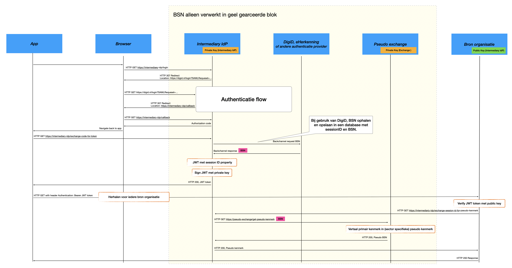

# Applicatie architectuur

## Context

Deze context beschrijft de randvoorwaarden voor de TransparantieApp die burgers en bedrijven inzicht
geeft in hoe hun gegevens worden gebruikt door verschillende overheidsorganisaties, zonder dat
deze organisaties hun data of verantwoordelijkheid uit handen geven.

- Er zijn **meerdere bronorganisaties**
- Elke bronorganisatie:
    - Beheert **eigen data**
    - Houdt **eigen logs** bij van dataverwerkingen
    - Is zelf verantwoordelijk voor juistheid, volledigheid en autorisatie van haar data
    - Blijft autonoom in technische inrichting en beheer
- Een dataverwerking is bijvoorbeeld:
    - Inzien van (persoons)gegevens
    - Wijzigen van (persoons)gegevens
    - Afhankelijk van het detailniveau kan een logregel zowel metadata als concrete data bevatten. [[?LDV]] 
- Over alle organisaties heen wordt **BSN of RSIN** gebruikt als **identificatie kenmerk**
- Het doel is: Een **geconsolideerd overzicht** tonen aan een persoon of bedrijf van **alle dataverwerkingen** over **alle bronorganisaties** heen.
- Elke organisatie biedt een **API** waarmee logs kunnen worden opgevraagd op basis van **BSN/RSIN**.
- Gebruik bijvoorkeur OIDC. OIDC staat op de "Pas toe of leg uit" lijst van standaarden [[?FSAUTH]]. Ook SAML staat op deze lijst, maar het idee is om naar OIDC toe te migreren. 

## Authenticatie/autorisatie gebruiker TransparantieApp
In dit hoofdstuk worden meerdere architectuuroplossingen beschreven die het mogelijk maken om
dataverwerkingen uit verschillende bronorganisaties te ontsluiten en te presenteren in één
geconsolideerd overzicht.

De oplossingsrichtingen verschillen met name op de volgende aspecten:

- **Plaats van aggregatie**: centraal op een backend of decentraal in de client.
- **Complexiteit**: implementatie- en beheerslast voor frontend, backend en bronorganisaties.
- **Client-ondersteuning**: toepasbaarheid voor webapplicaties, native apps of beide.
- **Mate van standaardisatie**: aansluiting bij gangbare standaarden zoals OIDC versus
  maatwerkoplossingen.

De lijst met architectuuroplossingen is niet per definitie volledig. Andere oplossingen zijn mogelijk en een definitie keuze is op dit moment nog niet gemaakt. 

### Architectuuroplossing 1: Server-side aggregatie

#### Kernidee

De browser of mobiele app communiceert met één centrale backend, de aggregation backend. Deze backend:

- Roept **alle organisatie-API’s server-to-server** aan
- Aggegreert de logs
- Geeft **één** geconsolideerd resultaat terug

#### Sequence diagram

<figure>
  
  <figcaption>
    Sequence diagram van de aggregation architectuur
  </figcaption>
</figure>

#### Gedetailleerde flow

1. Applicatie opent een browser ten behoeve van login sessie
    - Via de intermediary IdP (Identity Provider) wordt een DigiD login sessie gestart
    - Intermediary IdP vertaald de SAML interface van DigiD naar een OIDC
    - Intermediary IdP wordt overbodig zodra DigiD OIDC aanbiedt
2. Applicatie vraagt een JWT token op
    - JWT token wordt verrijkt met een BSN nummer in het sub veld
3. Normalisatie & filtering
4. Aggregatie backend:
    - Haalt bij alle deelnemende bron organisaties de log verwerkingen op
    - Filtert eventueel per autorisatie
    - Sorteert op tijd of type verwerking etc.
5. Response
    - Frontend ontvangt één resultaat bericht

#### Voor- en nadelen

**Voordelen**

- Geschikt voor zowel web- als native applicaties
- Geen CORS headers nodig bij webapplicatie.
- Eenvoudige frontend implementatie. 
- Functionaliteit eenvoudig aan te bieden vanuit meerdere clients (web, native app, etc). 
- Open standaarden, tried-and-tested security model

**Nadelen**

- Aggregation backend is single point of failure.
- Aggregation backend heeft toegang tot het totaal overzicht alle log gegevens.
- Partieel resultaat tonen tijdens inladen lastiger te realiseren. Eventueel mogelijk door het streamen van newline delimited JSON via chucked HTTP maar dat maakt zowel de frontend als backend complexer.

#### Wanneer geschikt?

- Centrale aggregatie van log verwerkingen op backend geen bezwaar
- Eenvoudige frontend prioriteit
- BSN verwerking op frontend geen bezwaar

### Architectuuroplossing 2: Token gebaseerd (JWT) met decentrale aggregatie

#### Kernidee

Na authenticatie ontvangt de client een JWT dat:

- Ondertekend is door de identity provider.
- Iedere organisatie kan **verifiëren** op echtheid. 

Iedere organisatie levert alleen zijn eigen logs terug. De frontend roept meerdere organisatie-API’s direct aan.

#### Sequence diagram

<figure>
  
  <figcaption>
    Sequence diagram van de JWT architectuur
  </figcaption>
</figure>

#### Gedetailleerde flow

1. Applicatie opent een browser ten behoeve van login sessie
    - Via de intermediary IdP (Identity Provider) wordt een DigiD login sessie gestart
    - Intermediary IdP vertaald de SAML interface van DigiD naar een OIDC
    - Intermediary IdP wordt overbodig zodra DigiD OIDC aanbiedt
2. Applicatie vraagt een JWT token op
    - JWT token wordt verrijkt met een BSN nummer in het sub veld API-calls per organisatie
3. Client-side aggregatie
    - Frontend combineert resultaten
    - Sorteert en presenteert overzicht

#### Voor- en nadelen

**Voordelen**

- Geschikt voor zowel web- als native applicaties
- Geen centrale backend applicatie waarin alle log verwerkingen samen komen
- Open standaarden, tried-and-tested security model

**Nadelen**

- Complexiteit bij frontend:
    - Meerdere HTTP verzoeken. Het aantal te bevragen bronorganisaties bepaald het aantal te versturen HTTP verzoeken.
    - Foutafhandeling en retries van mislukte HTTP calls. Eventueel data partieel tonen indien een deel van de verzoeken is geslaagd en een deel is mislukt.
- CORS headers noodzakelijk om HTTP Headers cross-origin te kunnen versturen. 
    - CORS headers dienen ingesteld te worden bij iedere deelnemende organisatie 
    - Dit nadeel is niet van toepassing als de client een native app is
- Aggregatie code leeft in de frontend en zal per client (web, native, etc) opnieuw geïmplementeerd moeten worden.

#### Wanneer geschikt?

- Federatief landschap
- Geen centrale log verwerker gewenst
- Frontend mag complexer zijn
- BSN verwerking op frontend geen bezwaar

### Architectuuroplossing 3: VORijk implementatie

#### Kernidee

- Iedere app creëert een public/private key pair.
- De public key wordt opgestuurd naar een beheer-applicatie.
- Na authenticatie retourneert de beheer-applicatie een certificaat (= public key + BSN + signature)
- Iedere bron-organisatie kan het certificaat verifiëren op echtheid. 
- Iedere organisatie levert alleen zijn eigen logs terug
- Communicatie tussen app en bronorganisatie is versleuteld via mTLS verbinding. (Opmerking: onduidelijk of dit boven op HTTPS is, óf in plaats van)
- De frontend roept meerdere organisatie-API’s direct aan

#### Sequence diagram

<figure>
  
  <figcaption>
    Sequence diagram van de VORIJK architectuur
  </figcaption>
</figure>

#### Voor- en nadelen

**Voordelen**

- Geen centrale backend applicatie waarin alle log verwerkingen samen komen
- Slechts éénmalig inloggen bij DigiD. Gegevens worden daarna uitgewisseld op basis van het uitgegeven certificaat welke wordt opgeslagen op de telefoon van de gebruiker.

**Nadelen**

- Complexiteit bij frontend:
    - Meerdere calls
    - Foutafhandeling
- Certificaat wordt éénmalig aangemaakt in activatie stap en dient daarna opgeslagen te worden op de client t.b.v. vervolg sessies
- Public private key pairs gegeneerd op de client. Alle communicatie tussen bron organisatie en app gebruikt dezelfde key pair. Geen forward secrecy zoals bij een standaard HTTPS verbinding met DHE.
- Enkel te gebruiken voor een native-app
- Aggregatie code leeft in de frontend en zal per client (web, native, etc) opnieuw geïmplementeerd moeten worden.
- Afwijkend van open standaarden zoals SAML of OIDC. 
- Onduidelijk hoe keys worden geroteerd, (is er functionaliteit vergelijkbaar met  `Key Id` in JWT tokens beschikbaar?)
- Onduidelijk hoe een uitgegeven certificaat ge-revoked kan worden. 
- Authorisatie mogelijkheden beperkt: het certificaat bevat een BSN nummer en enkel data betreffende deze BSN is toegankelijk. Ook een ambtenaar kan geen toegang krijgen tot data, behalve de data gekoppeld aan zijn eigen BSN.

### Architectuur oplossing 4: pseudoniemen 

#### Kernidee

Beperk verspeiding van het primair identificeerde kenmerken (BSN, RSIN, etc). 

- Laat de gebruiken kiezen waarmee hij of zij zich wil identificeren, b.v. via Digi-D of via e-Herkenning. 
- Communiceer geen gevoelige gegevens zoals een BSN aan de frontend maar een session ID. 
- Gebruik van BSN nummer blijft beperkt tot identify provider, DigiD en pseudo exchange service. De frontend (browser of native app) en de bronorganisaties werken niet met het BSN.

In de kern is deze architetuuroplossing een uitbreiding op oplossing 2 (JWT) waarbij de verspreiding van primair identificeren kenmerken zoveel mogelijk beperkt wordt.

#### Sequence diagram

<figure>
  
  <figcaption>
    Sequence diagram van de pseudoniemen architectuur
  </figcaption>
</figure>

[Verwerkingsverantwoordelijken](https://logius-standaarden.github.io/logboek-dataverwerkingen/#dfn-verantwoordelijke) staan vrij om zelf een identifier te kiezen. Dit is het `data subject id`. Dit mag het BSN zijn indien de verwerkingsverantwoordelijke hiervoor een wettelijke grondslag heeft, maar dat hoeft niet. 

Voor een correcte werking van de applicatie is het wel van belang dat een verwerkingsverantwoordelijke in staat is om een session ID (welke zich bevindt in het JWT token) om te zetten in zijn eigen gekozen identifier (`data subject id`). 

De identity provider biedt hiervoor een voorziening. Door middel van een server-to-server API call kan het session ID uit het JWT omgezet worden in de identifier (`data subject id`) van de verwerkingsverantwoordelijke. Dit process verloopt in twee stappen. In de eerste stap wordt het session ID omgezet naar een primaire identificeerd kenmerk, b.v. een BSN voor een burger of een RSIN voor een bedrijf. In de tweede stap, welke optioneel is, wordt dit kenmerk omgezet in een pseudo kenmerk. 

Verwerkingsverantwoordelijken welke wettelijk de primair identificeerde kenmerken mogen gebruiken, kunnen de tweede stap overslaan en b.v. rechtstreeks het BSN gebruiken. Gevolg hiervan is dat primair identificerende kenmerken, zoals het BSN, worden hiermee ook bekend bij de verwerkingsverantwoordelijke. De tweede stap is nodig wanneer de verwerkingsverantwoordelijken niet met de primair identifierende kenmerken kunnen of willen werken. In dat geval kan de verwerkingsverantwoordelijke een pseudo-exchange service aanwijzen. De identify provider laat dan eerst het primair identificeerde kenmerk door de pseudo-exchange vertalen naar een pseudo kenmerk. Het pseudo kenmerk wordt vervolgens weer terug gegeven aan de verwerkingsverantwoordelijke en gebruikt als `data subject id` waarmee de log gegevens zijn opgeslagen.

Een pseudo kenmerk kan b.v. tot stand komen door het primair identificeerde kenmerk te versleutelen met een steutel welke alleen bekend is bij de pseudo exchange service, maar niet bij de bron organisatie. De vertaling van een primair identificeerde kenmerk levert dus altijd hetzelfde pseudo-kenmerk op, maar vanuit het pseudo kenmerk kan niet het primair identificeerde kenmerk herleid worden. 

#### Voor- en nadelen

**Voordelen**

- Verwerking van primair identificeerde kenmerken zoals BSN blijft beperkt. De client (browser of native-app) en de verwerkingsverantwoordelijke verwerken deze niet. 

**Nadelen**

- Iedere API call naar een verwerkingsverantwoordelijke, resulteert in een extra server-to-server API call, richting de identify provider.  

Zie daarnaast de [voor- en nadelen](#voor-en-nadelen-0) van architectuur oplossing 2. 

### Vergelijking

| Aspect                                               | Backend aggregatie | JWT          | VO-RIJK     | Pseudoniemen            | 
| ---------------------------------------------------- | ------------------ | ------------ | ----------- | ----------------------- | 
| BSN in frontend                                      | Ja                 | Ja           | Ja          | Nee                     |
| Log gegevens centraal verwerkt                       | Ja                 | Nee          | Nee         | Nee                     |
| Aggregatie                                           | Backend            | Frontend     | Frontend    | Frontend                |
| Complexiteit frontend                                | Laag               | Gemiddeld    | Hoog        | Gemiddeld               |
| Compatibel met type clients                          | Web & Native       | Web & Native | Native      | Web & Native            |
| Identificeerde kenmerken                             | BSN [1]            | BSN          | Enkel BSN   | Keuze verantwoordelijke |
| Logregels lezen over meerdere subject ID's mogelijk  | Ja                 | Ja           | Nee         | Ja                      |

[1] Variant waarbij de keuze aan de verwerkingsverantwoordelijke overgelaten wordt mogelijk. 

### Nog niet bekeken alternatieven

#### DigiD App in plaats van Browser

Inloggen met DigiD kan via app2app [[?DIGIDAPP2APP]]. De gebruiker maakt dan geen uitstapje naar de webbrowser maar een uitstapje naar de DigiD app. Er zijn twee varianten beschreven via SAML en via OIDC. Echter de OIDC variant is nog niet algemeen beschikbaar:
> Noot: Deze aansluitvorm is nog niet algemeen beschikbaar voor dienstaanbieders.  

#### Alternatief vergelijkbaar met Medmij 

Als alternatief kan gekeken worden naar Medmij. Het Medmij stelsel is een set van afspraken om gegevens uit te wisselen tussen PGO's (Persoonlijke Gezondheidsomgevingen) en zorgdienstverleners welke gegevens beschikbaar stellen (Ziekenhuis, huisarts, lab). In het Medmij stelsel wordt expliciet toestemming gevraagd om gegevens te delen. De gebruiker dient per zorgdienstverlener expliciet toestemming te geven voor het delen van informatie met de PGO. Zonder deze toestemming is er dus geen data te zien in het PGO. Qua UX heeft dit overduidelijk nadelen, maar de gegevens uitwisseling is heel helder en er wordt alleen data uitgewisseld indien de gebruiker hiervoor akkoord heeft gegeven. 

### Conclusie Authenticatie/Autorisatie

We kiezen voor de eerste imlementatie voor de JWT oplossing. Deze is op korte termijn implementeerbaar en laat de meeste ruimte voor usecases waarbij andere gebruikers dan burger/bedrijf via de transparatntieApp ook de lezen API willen benaderen. Denk bijvoorbeeld aan ambtenaren die vanuit hun functie willen herleiden wat er gebeurd is. We verkennen de optie VO-Rijk wel verder, waarbij we eerst nader kijken of de JWT die in VO-rijk wordt toegepast compatible is met het NLGov profiel op OAuth 2.0[[OAuth]].

## Keuze web-app vs native-app

Er zijn groweg twee manieren om een app voor een telefoon (of tablet) te maken. Een is een native app voor het besturingssysteem van je device, in de praktijk android of IOS/IpadOS. De andere is een app die feitelijk een webpagina is die (ook) geoptimaliseerd is voor gebruik op telefoon/tablet. Deze laatste heet een web-app.

### Native-app

We zijn er bij de oorspronkelijke aanvraag van dit project vanuit gegaan dat we de aanpak van VO-Rijk zoveel mogelijk volgen. Dat zou voor deze keuze betekenen dat we een native app bouwen. Voordeel is dat we hergebruik kunnen maken van VO-rijk componenten en dat je gebruikt kan maken van device native voorzieningen zoals een "secure enclave" voor het bewaren van private keys voor beveiliging.

### Web-app

We weten echter ook dat het eindresultaat geen productiewaardige app gaat zijn en we willen wel dat het resultaat zoveel als mogelijk herbruikbaar is. Met name voor herbruikbaarheid biedt de webapp voordelen. Het maakt onze resultaten (UX design, design system, gebruikersonderzoek) beter herbruikbaar omdat het ook direct toepasbaar is in browsers op desktops. Wanneer we voor een webapp (en HTML) kiezen kunnen we hergebruik maken van het NL-designsystem[[NL-Design]]. Dit design system bestaat al en is al ontwikkeld op voor ons belangrijke requirements als WCAG compliance[[WCAG]] en voldoet aan de rijkshuisstijl.  

### Conclusie

We laten de herbruikbaarheid zwaarder wegen en kiezen voor een web-app.