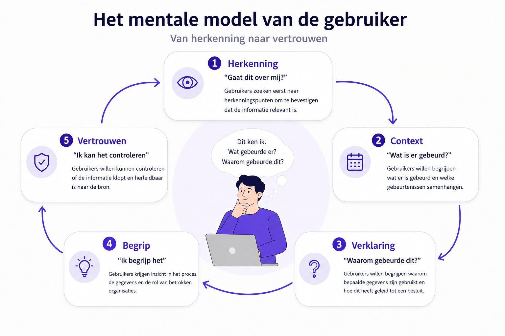

# User eXperience

## Mentale model van data transparantie: Van herkenning naar vertrouwen

Uit het gebruikersonderzoek blijkt dat burgers niet direct op zoek zijn naar gedetailleerde informatie over gegevensverwerkingen, besluitvorming of logging. Voordat gebruikers een proces proberen te begrijpen, zoeken zij eerst naar herkenningspunten die bevestigen dat de informatie betrekking heeft op hun situatie.

Deze herkenningspunten bestaan voornamelijk uit betrokken organisaties, datums, gebeurtenissen en gebruikte gegevens. Wanneer gebruikers deze elementen herkennen, ontstaat voldoende context om zich verder te verdiepen in het proces en de achterliggende besluitvorming.

Op basis van de onderzoeksresultaten wordt het volgende conceptuele model voorgesteld:

**Herkenning → Context → Verklaring → Begrip → Vertrouwen**

Binnen dit model vormt herkenning de eerste stap. Gebruikers zoeken eerst bevestiging dat informatie relevant is voor hun situatie. Vervolgens proberen zij de context van gebeurtenissen te begrijpen, waarna behoefte ontstaat aan een verklaring van waarom bepaalde handelingen of besluiten hebben plaatsgevonden. Wanneer deze informatie begrijpelijk wordt gepresenteerd, ontstaat meer inzicht in het proces en uiteindelijk meer vertrouwen in de uitkomst.

Dit model suggereert dat transparantievoorzieningen niet zouden moeten beginnen met technische details of complexe visualisaties, maar met informatie die gebruikers direct kunnen relateren aan hun eigen situatie. Herkenning vormt daarmee de basis voor verdere verdieping.

Het model kan tevens worden vertaald naar verschillende informatieniveaus binnen de gebruikersinterface:

| Niveau              | Doel gebruiker                         | Voorbeelden van componenten                             |
| ------------------- | -------------------------------------- | ------------------------------------------------------- |
| Herkenning          | "Gaat dit over mij?"                   | Organisatienaam, datum, gebeurtenis, gebruikte gegevens |
| Context             | "Wat is er gebeurd?"                   | Tijdlijn, dossier, relatie tussen gebeurtenissen        |
| Verklaring          | "Waarom gebeurde dit?"                 | Samenvatting, besluituitleg, oorzaak-gevolgrelaties     |
| Begrip & vertrouwen | "Kan ik dit begrijpen en controleren?" | Broninformatie, logging, auditinformatie                |

**Beschrijving infographic**

Infographic met de titel "Het mentale model van de gebruiker – Van herkenning naar vertrouwen". In het midden staat een persoon achter een laptop. Boven de persoon staat een tekstballon met de vragen: "Dit ken ik. Wat gebeurde er? Waarom gebeurde dit?". Rondom de persoon staan vijf stappen die met pijlen in een cirkel met elkaar verbonden zijn.

1. Herkenning – "Gaat dit over mij?"
Gebruikers zoeken eerst naar herkenningspunten om vast te stellen dat de informatie betrekking heeft op hun situatie. Voorbeelden zijn een bekende organisatie, een datum, een gebeurtenis of gebruikte gegevens.

2. Context – "Wat is er gebeurd?"
Gebruikers willen begrijpen welke gebeurtenissen hebben plaatsgevonden en hoe deze met elkaar samenhangen.

3. Verklaring – "Waarom gebeurde dit?"
Gebruikers willen weten waarom bepaalde gegevens zijn gebruikt en hoe deze hebben bijgedragen aan een besluit of gebeurtenis.

4. Begrip – "Ik begrijp het"
Gebruikers krijgen inzicht in het proces, de gebruikte gegevens en de rol van betrokken organisaties.

5. Vertrouwen – "Ik kan het controleren"
Gebruikers willen kunnen controleren of de informatie correct is en herleidbaar is naar de bron.

De pijlen tussen de stappen tonen een oplopend proces van informatieverwerking. Het model laat zien dat gebruikers eerst behoefte hebben aan herkenning voordat zij context, verklaringen en begrip zoeken. Vertrouwen ontstaat pas nadat gebruikers voldoende inzicht hebben gekregen in wat er is gebeurd en waarom.

## Persona's

De onderstaande persona's zijn opgesteld op basis van een vragenlijstonderzoek onder potentiële gebruikers van de TransparantieApp. In deze vragenlijst is deelnemers gevraagd om het belang van verschillende transparantiefuncties te beoordelen op een Likert-schaal van **1 tot 7**, waarbij:

* **1 = Helemaal niet belangrijk**
* **7 = Zeer belangrijk**

De gemiddelde scores zijn gebruikt om patronen in informatiebehoeften en voorkeuren te identificeren. Op basis van deze patronen zijn drie persona's opgesteld die verschillende houdingen ten opzichte van datatransparantie vertegenwoordigen. De persona's zijn daarmee geen beschrijving van individuele respondenten, maar archetypen die zijn afgeleid uit de verzamelde onderzoeksgegevens.

De persona's helpen om verschillen in informatiebehoefte, gewenste mate van controle en behoefte aan detail inzichtelijk te maken. Zij vormen een hulpmiddel bij het ontwerpen en prioriteren van functionaliteiten binnen de TransparantieApp.

### Onderzoeksopzet

De onderstaande persona's zijn opgesteld op basis van een vragenlijstonderzoek onder potentiële gebruikers van de TransparantieApp. In deze vragenlijst is deelnemers gevraagd om het belang van verschillende transparantiefuncties te beoordelen op een Likert-schaal van **1 tot 7**, waarbij:

* **1 = Helemaal niet belangrijk**
* **7 = Zeer belangrijk**

De gemiddelde scores zijn gebruikt om patronen in informatiebehoeften en voorkeuren te identificeren. Op basis van deze patronen zijn drie persona's opgesteld die verschillende houdingen ten opzichte van datatransparantie vertegenwoordigen.

De persona's zijn daarmee geen beschrijving van individuele respondenten, maar archetypen die zijn afgeleid uit de verzamelde onderzoeksgegevens. Zij helpen om verschillen in informatiebehoefte, gewenste mate van controle en behoefte aan detail inzichtelijk te maken.

### Fatima (28) – De actieve burger

Fatima is sterk geïnteresseerd in wat er met haar persoonsgegevens gebeurt. Ze maakt zich zorgen over hoe organisaties haar gegevens gebruiken en wil daarom vooral inzicht en controle.

Uit de analyse blijkt dat voor Fatima vooral functies belangrijk zijn die haar direct laten zien wie toegang heeft tot haar gegevens (*gemiddelde score 6,89*) en met welke organisaties haar gegevens zijn gedeeld (*gemiddelde score 6,89*). Deze hoge scores laten zien dat transparantie over datatoegang en datadeling voor haar essentieel is.

Daarnaast vindt Fatima het zeer belangrijk dat zij haar gegevens kan controleren en corrigeren wanneer deze niet kloppen. De mogelijkheid om actie te ondernemen wanneer gegevens onjuist zijn, bijvoorbeeld door correctie of bezwaar, krijgt een gemiddelde score van *6,89*. Dit geeft aan dat controle over persoonlijke data voor haar een kernfunctie is.

Fatima is ook geïnteresseerd in meer inhoudelijke uitleg over datagebruik. Zo vindt zij het belangrijk om te begrijpen waarom haar gegevens worden gebruikt (*gemiddelde score 6,67*) en of haar gegevens invloed hebben gehad op een besluit (*gemiddelde score 6,56*). Transparantie gaat voor haar dus niet alleen over toegang tot data, maar ook over het begrijpen hoe beslissingen tot stand komen.

Meer technische functies, zoals het zien welke verwerkingen op haar gegevens zijn uitgevoerd (*gemiddelde score 6,33*) of een volledig overzicht van de route die haar gegevens door organisaties hebben afgelegd (*gemiddelde score 5,78*), zijn voor Fatima iets minder belangrijk.

Voor Fatima staat een transparantievoorziening vooral in het teken van **begrijpen, controleren en kunnen handelen wanneer dat nodig is**.

### Marc (54) – De geïnteresseerde maar praktische gebruiker

Marc is geïnteresseerd in hoe zijn gegevens worden gebruikt, maar wil het vooral overzichtelijk en praktisch houden.

Hij vindt het belangrijk om te kunnen zien welke organisaties toegang hebben tot zijn gegevens (*gemiddelde score 6,7*) en met wie deze gegevens zijn gedeeld (*gemiddelde score 6,6*). Dit geeft hem een gevoel van controle zonder dat hij zich hoeft te verdiepen in complexe details.

Ook vindt Marc het belangrijk dat hij zijn gegevens kan controleren op juistheid (*gemiddelde score 6,5*) en dat hij actie kan ondernemen wanneer gegevens niet kloppen (*gemiddelde score 6,9*). Deze hoge score laat zien dat ook voor hem het kunnen corrigeren van gegevens een belangrijke functie is.

Hoewel Marc transparantie waardeert, wil hij niet te diep in technische details duiken. Functies zoals inzicht in welke verwerkingen op zijn gegevens zijn uitgevoerd (*gemiddelde score 5,8*) of een volledig overzicht van de route die gegevens tussen organisaties afleggen (*gemiddelde score 6,0*) zijn voor hem minder belangrijk dan een duidelijk en eenvoudig overzicht.

Voor Marc betekent transparantie vooral dat hij snel kan controleren of alles klopt en eenvoudig kan ingrijpen als dat nodig is, zonder zich te hoeven verdiepen in technische details.

### Peter(55) – De inactieve gebruiker

Peter denkt in het dagelijks leven nauwelijks na over zijn persoonsgegevens. Digitale diensten gebruikt hij vooral omdat ze handig zijn en hij staat zelden stil bij hoe zijn gegevens worden verwerkt. Toch vindt hij het belangrijk dat hij kan ingrijpen wanneer er iets misgaat.

Ook bij deze persona blijkt uit de data dat de mogelijkheid om actie te ondernemen bij onjuiste gegevens belangrijk is (*gemiddelde score 6,36*). Daarnaast vindt hij het belangrijk om te kunnen zien welke organisaties toegang hebben tot zijn gegevens (*gemiddelde score 6,36*) en met welke organisaties gegevens zijn gedeeld (*gemiddelde score 6,18*).

Meer complexe functies, zoals inzicht in welke verwerkingen op gegevens zijn uitgevoerd (*gemiddelde score 4,9*) of een volledig overzicht van de route die gegevens tussen organisaties afleggen (*gemiddelde score 4,7*), zijn voor hem duidelijk minder belangrijk. Deze informatie voelt voor hem vaak te technisch of te uitgebreid.

Voor Peter is een transparantievoorziening vooral waardevol wanneer deze eenvoudig, duidelijk en probleemgericht is. Hij wil vooral weten dat hij geholpen wordt wanneer er iets misgaat, zonder actief op zoek te hoeven naar uitgebreide informatie.

### Els (90) – De kwetsbare burger

> **Let op:** Deze persona is niet direct gebaseerd op de uitgevoerde vragenlijst of gebruikerstesten. De persona is opgesteld op basis van inzichten uit literatuuronderzoek, toegankelijkheidsrichtlijnen en algemene ontwerpprincipes rondom inclusieve digitale dienstverlening.

Els heeft beperkte digitale vaardigheden en vindt het moeilijk om te begrijpen hoe haar gegevens worden gebruikt. Zij is sterk afhankelijk van overheidsorganisaties en digitale systemen, maar heeft vaak onvoldoende kennis of vertrouwen om complexe informatie zelfstandig te interpreteren.

Els heeft behoefte aan eenvoudige uitleg, duidelijke taal en stapsgewijze begeleiding. Wanneer informatie te uitgebreid, technisch of abstract wordt gepresenteerd, verliest zij het overzicht. Voor haar is het belangrijk dat informatie bevestigt dat alles correct verloopt en dat duidelijk wordt aangegeven wat zij moet doen wanneer er iets misgaat.

In tegenstelling tot de andere persona's heeft Els weinig behoefte aan diepgaande analyses van gegevensverwerkingen of besluitvorming. Zij wil vooral weten dat processen correct verlopen en dat zij ondersteuning kan krijgen wanneer dat nodig is.

Voor Els betekent grip niet het verkrijgen van meer informatie, maar het ervaren van duidelijkheid, zekerheid en begeleiding.

Belangrijkste behoeften die ze heeft zijn:

* Eenvoudige en begrijpelijke taal.
* Duidelijke navigatie en consistente interactiepatronen.
* Bevestiging dat processen correct verlopen.
* Ondersteuning bij het ondernemen van actie.

Ontwerpimplicaties

Hoewel deze doelgroep buiten de primaire scope van het onderzoek viel, benadrukt deze persona het belang van toegankelijkheid en inclusiviteit binnen de TransparantieApp. Ontwerpkeuzes zoals gelaagde informatie, samenvattingen, herkenbare navigatiepatronen en begrijpelijke taal dragen niet alleen bij aan de gebruikservaring van Els, maar verbeteren de toegankelijkheid voor alle gebruikers.

### Vergelijking van de persona's

De verschillen tussen de persona's zitten voornamelijk in de mate waarin zij actief betrokken willen zijn bij het gebruik van hun persoonsgegevens en de hoeveelheid detail die zij wensen.

| Persona | Houding                         | Primaire behoefte                  | Detailniveau |
| ------- | ------------------------------- | ---------------------------------- | ------------ |
| Fatima  | Actief betrokken                | Begrijpen, controleren en handelen | Hoog         |
| Marc    | Geïnteresseerd maar pragmatisch | Overzicht en zekerheid             | Middel       |
| Peter   | Inactief totdat er iets misgaat | Probleem oplossen                  | Laag         |
| Els     | Voelt zich onzeker              | Ontzien worden en dingen geregeld zijn| Laag       |

### Gemeenschappelijke behoeften

Opvallend is dat alle drie de persona's behoefte hebben aan dezelfde basisinformatie:

* Welke organisaties toegang hebben tot hun gegevens.
* Met welke organisaties gegevens zijn gedeeld.
* De mogelijkheid om gegevens te controleren.
* De mogelijkheid om fouten te corrigeren.

De verschillen ontstaan voornamelijk in de behoefte aan verdieping en technische details.

Deze bevinding ondersteunt de hypothese dat transparantie gelaagd moet worden aangeboden: een gemeenschappelijke basislaag kan voorzien in de informatiebehoefte van alle gebruikers, terwijl aanvullende detailniveaus ruimte bieden aan gebruikers die meer inzicht wensen in gegevensverwerkingen en besluitvorming.

## Reflectie: doelgroep buiten de scope van het onderzoek

Naast de onderzochte persona's is er een groep burgers waarvoor digitale transparantievoorzieningen mogelijk minder geschikt zijn. Hierbij kan gedacht worden aan mensen met zeer beperkte digitale vaardigheden, laaggeletterden, mensen met bepaalde cognitieve beperkingen of burgers die weinig gebruikmaken van digitale overheidsdiensten.

Voor deze doelgroep is niet specifiek gebruikersonderzoek uitgevoerd. De verwachting is dat oplossingen voor deze gebruikers niet uitsluitend digitaal van aard zijn, maar mogelijk aanvullende ondersteuning vereisen, zoals persoonlijke dienstverlening, telefonische ondersteuning of fysieke loketten. Het onderzoeken van dergelijke oplossingen viel buiten de scope van dit project.

Dit betekent echter niet dat deze doelgroep buiten beschouwing is gelaten. Bij het ontwerp van de TransparantieApp is rekening gehouden met algemene toegankelijkheids- en inclusiviteitsprincipes. Hierbij zijn onder andere de WCAG-richtlijnen, principes van gebruiksvriendelijkheid en ontwerp voor een diverse gebruikersgroep als uitgangspunt genomen.

Toekomstig onderzoek kan zich richten op de vraag hoe transparantie over gegevensgebruik en besluitvorming toegankelijk kan worden gemaakt voor burgers die minder digitaal vaardig zijn of andere vormen van ondersteuning nodig hebben.Voor volledigeheid hebben we deze wel meegenomen als persona in dit onderzoek om over na te denken bij design beslissingen.

Naast de onderzochte persona's is er een groep burgers waarvoor digitale transparantievoorzieningen mogelijk minder geschikt zijn. Hierbij kan gedacht worden aan mensen met zeer beperkte digitale vaardigheden, laaggeletterden, mensen met bepaalde cognitieve beperkingen of burgers die weinig gebruikmaken van digitale overheidsdiensten.

Voor deze doelgroep is niet specifiek gebruikersonderzoek uitgevoerd. De verwachting is dat oplossingen voor deze gebruikers niet uitsluitend digitaal van aard zijn, maar mogelijk aanvullende ondersteuning vereisen, zoals persoonlijke dienstverlening, telefonische ondersteuning of fysieke loketten. Het onderzoeken van dergelijke oplossingen viel buiten de scope van dit project.

Dit betekent echter niet dat deze doelgroep buiten beschouwing is gelaten. Bij het ontwerp van de TransparantieApp is rekening gehouden met algemene toegankelijkheids- en inclusiviteitsprincipes. Hierbij zijn onder andere de WCAG-richtlijnen, principes van gebruiksvriendelijkheid en ontwerp voor een diverse gebruikersgroep als uitgangspunt genomen.

Toekomstig onderzoek kan zich richten op de vraag hoe transparantie over gegevensgebruik en besluitvorming toegankelijk kan worden gemaakt voor burgers die minder digitaal vaardig zijn of andere vormen van ondersteuning nodig hebben.

## Ontwerp

### Aanbevolen ontwerp

### Ontwerp beslissingen

## Experience map:  Van Onzichtbare Verwerking naar Vertrouwen
Deze experience map beschrijft hoe mensen de verwerking en uitwisseling van persoonsgegevens ervaren gedurende hun interactie met organisaties. De kaart laat zien dat gegevensverwerking in de meeste situaties onzichtbaar en probleemloos verloopt. Pas wanneer er iets onverwachts gebeurt, ontstaat de behoefte aan inzicht, uitleg en handelingsperspectief.

De experience map bestaat uit twee delen. Het eerste deel beschrijft de normale gebruikerservaring: van een verwachting waarmee iemand een proces start, via de onzichtbare verwerking van gegevens, naar een voorspelbaar resultaat. Het tweede deel richt zich op de situatie waarin deze verwachting wordt doorbroken. De gebruiker ervaart een verstoring, zoekt naar een verklaring, wil begrijpen wat er is gebeurd en zoekt mogelijkheden om invloed uit te oefenen. Uiteindelijk kan opnieuw vertrouwen ontstaan wanneer voldoende transparantie, context en handelingsperspectief worden geboden.

Onder iedere experience map staat een ontwerpanalyse. Deze analyse vertaalt de observaties uit de gebruikerservaring naar ontwerpinzichten. Per fase worden de onderliggende behoeften, risico's en ontwerpkansen benoemd. Deze inzichten vormen het uitgangspunt voor het ontwerpen van interventies, interfaces en dienstverlening die transparantie vergroten, gebruikers meer regie geven en het vertrouwen in gegevensverwerking versterken.

## 1. Gebruikerservaring

| Fase | 1. Verwachting | 2. Verwerking | 3. Normaal verloop |
|-------|----------------|---------------|---------------------|
| **Wat gebeurt er?** | Persoon wil iets bereiken | Organisaties verwerken gegevens | Alles verloopt zoals verwacht |
| **Gebruikersdoel** | Taak afronden | Geen actief doel | Resultaat ontvangen |
| **Gedachten** | "Dit zal wel geregeld worden." | "Dat gebeurt automatisch." | "Prima." |
| **Emoties** | Vertrouwend | Onbezorgd | Tevreden |
| **Vragen** | Wat moet ik doen? | Geen | Geen |

### Ontwerpanalyse

| Analyse | 1. Verwachting | 2. Verwerking | 3. Normaal verloop |
|----------|----------------|---------------|---------------------|
| **Behoefte** | Gemak | Vertrouwen | Voorspelbaarheid |
| **Risico** | Complexiteit | Onzichtbaarheid | Onverschilligheid |
| **Kans** | Duidelijke start | Transparante processen | Frictieloze ervaring |

---

## 2. Van verstoring naar vertrouwen

| Fase | 4. Verstoring | 5. Begrijpen | 6. Handelen | 7. Vertrouwen |
|-------|---------------|--------------|-------------|----------------|
| **Wat gebeurt er?** | Er gebeurt iets onverwachts | Persoon zoekt uitleg | Persoon wil invloed uitoefenen | Nieuwe balans ontstaat |
| **Gebruikersdoel** | Begrijpen wat er gebeurt | Oorzaak achterhalen | Probleem oplossen | Zekerheid krijgen |
| **Gedachten** | "Huh? Waarom gebeurt dit? Welke gegevens zijn hier gedeeld?" | "Hoe zit dit precies?" | "Wat kan ik nu doen?" | "Oké, ik snap het." |
| **Emoties** | Onzeker | Onderzoekend | Doelgericht | Gerustgesteld |
| **Vragen** | Waarom gebeurt dit? Welke gegevens zijn gedeeld? | Wie? Waarom? Hoe? | Welke opties heb ik? | Kan ik erop vertrouwen? |

### Ontwerpanalyse

| Analyse | 4. Verstoring | 5. Begrijpen | 6. Handelen | 7. Vertrouwen |
|----------|---------------|--------------|-------------|----------------|
| **Behoefte** | Verklaring | Context | Handelingsperspectief | Zekerheid |
| **Risico** | Verwarring | Informatie-overload | Machteloosheid | Wantrouwen |
| **Kans** | Tijdige signalering | Begrijpelijke uitleg | Actie mogelijk maken | Vertrouwen versterken |

