# User eXperience
Om inzicht te krijgen in de gebruikerservaring rondom de verwerking en uitwisseling van persoonsgegevens zijn persona's, een mental model en een experience map opgesteld. De persona's beschrijven representatieve gebruikers met verschillende doelen, behoeften en contexten en helpen om ontwerpkeuzes vanuit het perspectief van de gebruiker te maken. Het mental model brengt de verwachtingen, aannames en overtuigingen van deze gebruikers over gegevensverwerking in kaart. De experience map laat vervolgens zien hoe deze verwachtingen zich vertalen naar de feitelijke gebruikerservaring: van verwachting en onzichtbare verwerking tot verstoring, begrip, handelen en vertrouwen. In tegenstelling tot een customer journey, die de interactie binnen een specifieke casus of dienstverlening beschrijft, biedt de experience map een overkoepelend beeld van de gebruikerservaring over verschillende organisaties en situaties heen. Samen vormen deze UX-methoden de basis voor het identificeren van behoeften, risico's en ontwerpkansen.

## Mentale model van data transparantie: Van herkenning naar vertrouwen

Uit het gebruikersonderzoek blijkt dat burgers niet direct op zoek zijn naar gedetailleerde informatie over gegevensverwerkingen, besluitvorming of logging. Voordat gebruikers een proces proberen te begrijpen, zoeken zij eerst naar herkenningspunten die bevestigen dat de informatie betrekking heeft op hun situatie.

Deze herkenningspunten bestaan voornamelijk uit betrokken organisaties, datums, gebeurtenissen en gebruikte gegevens. Wanneer gebruikers deze elementen herkennen, ontstaat voldoende context om zich verder te verdiepen in het proces en de achterliggende besluitvorming.

Op basis van de onderzoeksresultaten wordt het volgende conceptuele model voorgesteld:

**Herkenning → Context → Verklaring → Begrip → Vertrouwen**

Binnen dit model vormt herkenning de eerste stap. Gebruikers zoeken eerst bevestiging dat informatie relevant is voor hun situatie. Vervolgens proberen zij de context van gebeurtenissen te begrijpen, waarna behoefte ontstaat aan een verklaring van waarom bepaalde handelingen of besluiten hebben plaatsgevonden. Wanneer deze informatie begrijpelijk wordt gepresenteerd, ontstaat meer inzicht in het proces en uiteindelijk meer vertrouwen in de uitkomst.

Dit model suggereert dat transparantievoorzieningen niet zouden moeten beginnen met technische details of complexe visualisaties, maar met informatie die gebruikers direct kunnen relateren aan hun eigen situatie. Herkenning vormt daarmee de basis voor verdere verdieping.

Het model kan tevens worden vertaald naar verschillende informatieniveaus binnen de gebruikersinterface:

| Niveau              | Doel gebruiker                         | Voorbeelden van componenten                             |
| ------------------- | -------------------------------------- | ------------------------------------------------------- |
| Herkenning          | "Gaat dit over mij?"                   | Organisatienaam, datum, gebeurtenis, gebruikte gegevens |
| Context             | "Wat is er gebeurd?"                   | Tijdlijn, dossier, relatie tussen gebeurtenissen        |
| Verklaring          | "Waarom gebeurde dit?"                 | Samenvatting, besluituitleg, oorzaak-gevolgrelaties     |
| Begrip & vertrouwen | "Kan ik dit begrijpen en controleren?" | Broninformatie, logging, auditinformatie                |

<a href="media/Mentalmodel.png">
  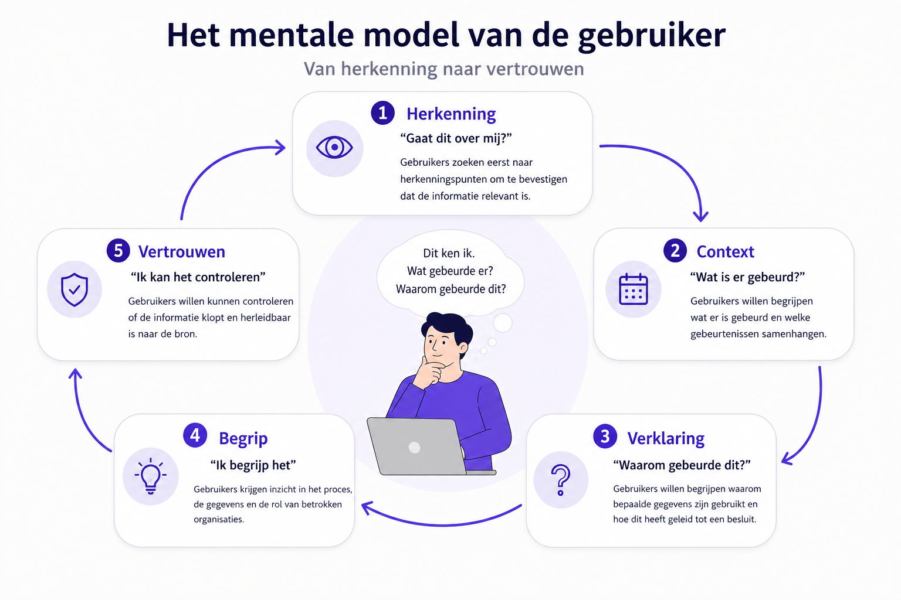
</a>

**Beschrijving infographic**

Infographic met de titel "Het mentale model van de gebruiker – Van herkenning naar vertrouwen". In het midden staat een persoon achter een laptop. Boven de persoon staat een tekstballon met de vragen: "Dit ken ik. Wat gebeurde er? Waarom gebeurde dit?". Rondom de persoon staan vijf stappen die met pijlen in een cirkel met elkaar verbonden zijn.

1. Herkenning – "Gaat dit over mij?"
Gebruikers zoeken eerst naar herkenningspunten om vast te stellen dat de informatie betrekking heeft op hun situatie. Voorbeelden zijn een bekende organisatie, een datum, een gebeurtenis of gebruikte gegevens.

2. Context – "Wat is er gebeurd?"
Gebruikers willen begrijpen welke gebeurtenissen hebben plaatsgevonden en hoe deze met elkaar samenhangen.

3. Verklaring – "Waarom gebeurde dit?"
Gebruikers willen weten waarom bepaalde gegevens zijn gebruikt en hoe deze hebben bijgedragen aan een besluit of gebeurtenis.

4. Begrip – "Ik begrijp het"
Gebruikers krijgen inzicht in het proces, de gebruikte gegevens en de rol van betrokken organisaties.

5. Vertrouwen – "Ik kan het controleren"
Gebruikers willen kunnen controleren of de informatie correct is en herleidbaar is naar de bron.

De pijlen tussen de stappen tonen een oplopend proces van informatieverwerking. Het model laat zien dat gebruikers eerst behoefte hebben aan herkenning voordat zij context, verklaringen en begrip zoeken. Vertrouwen ontstaat pas nadat gebruikers voldoende inzicht hebben gekregen in wat er is gebeurd en waarom.

## Experience map:  Van Onzichtbare Verwerking naar Vertrouwen
Deze experience map beschrijft hoe mensen de verwerking en uitwisseling van persoonsgegevens ervaren gedurende hun interactie met organisaties. De kaart laat zien dat gegevensverwerking in de meeste situaties onzichtbaar en probleemloos verloopt. Pas wanneer er iets onverwachts gebeurt, ontstaat de behoefte aan inzicht, uitleg en handelingsperspectief.

De experience map bestaat uit twee delen. Het eerste deel beschrijft de normale gebruikerservaring: van een verwachting waarmee iemand een proces start, via de onzichtbare verwerking van gegevens, naar een voorspelbaar resultaat. Het tweede deel richt zich op de situatie waarin deze verwachting wordt doorbroken. De gebruiker ervaart een verstoring, zoekt naar een verklaring, wil begrijpen wat er is gebeurd en zoekt mogelijkheden om invloed uit te oefenen. Uiteindelijk kan opnieuw vertrouwen ontstaan wanneer voldoende transparantie, context en handelingsperspectief worden geboden.

Onder iedere experience map staat een ontwerpanalyse. Deze analyse vertaalt de observaties uit de gebruikerservaring naar ontwerpinzichten. Per fase worden de onderliggende behoeften, risico's en ontwerpkansen benoemd. Deze inzichten vormen het uitgangspunt voor het ontwerpen van interventies, interfaces en dienstverlening die transparantie vergroten, gebruikers meer regie geven en het vertrouwen in gegevensverwerking versterken.

## 1. Gebruikerservaring

| Fase | 1. Verwachting | 2. Verwerking | 3. Normaal verloop |
|-------|----------------|---------------|---------------------|
| **Wat gebeurt er?** | Persoon wil iets bereiken | Organisaties verwerken gegevens | Alles verloopt zoals verwacht |
| **Gebruikersdoel** | Taak afronden | Geen actief doel | Resultaat ontvangen |
| **Gedachten** | "Dit zal wel geregeld worden." | "Dat gebeurt automatisch." | "Prima." |
| **Emoties** | Vertrouwend | Onbezorgd | Tevreden |
| **Vragen** | Wat moet ik doen? | Geen | Geen |

### Ontwerpanalyse

| Analyse | 1. Verwachting | 2. Verwerking | 3. Normaal verloop |
|----------|----------------|---------------|---------------------|
| **Behoefte** | Gemak | Vertrouwen | Voorspelbaarheid |
| **Risico** | Complexiteit | Onzichtbaarheid | Onverschilligheid |
| **Kans** | Duidelijke start | Transparante processen | Frictieloze ervaring |

---

## 2. Van verstoring naar vertrouwen

Gegevensverwerking verloopt voor burgers veelal op de achtergrond. Zolang de uitkomst overeenkomt met hun verwachting, bestaat er doorgaans weinig behoefte om het onderliggende proces te onderzoeken. De behoefte aan transparantie wordt vooral relevant wanneer die verwachting wordt doorbroken: er ontbreekt bijvoorbeeld informatie, een uitkomst is onverwacht of iemand wil weten waarom gegevens zijn uitgewisseld.

Op zo'n moment probeert de gebruiker eerst te begrijpen wat er is gebeurd en waarom. De laatste gebruikerstesten laten daarbij zien dat transparantie ook een risico kent: wanneer informatie ontbreekt of onvoldoende wordt verklaard, kan de gebruiker zelf verklaringen gaan vormen. In plaats van onzekerheid weg te nemen, kan transparantie dan juist nieuwe onzekerheid of wantrouwen veroorzaken.

Daarom is het belangrijk om niet alleen te laten zien wat bekend is, maar ook transparant te zijn over wat niet bekend of beschikbaar is en waarom. Maak bijvoorbeeld duidelijk of een organisatie niet is aangesloten, er geen gegevensuitwisseling heeft plaatsgevonden of gegevens tijdelijk niet beschikbaar zijn. Wanneer incomplete gegevens onvoldoende betrouwbaar of begrijpelijk kunnen worden aangeboden, kan worden overwogen deze nog niet te tonen en de gebruiker in plaats daarvan naar de betreffende organisatie te verwijzen.

Ook moet transparantie leiden tot handelingsperspectief. Wanneer een gebruiker iets niet begrijpt of een mogelijke fout ontdekt, moet in dezelfde context duidelijk worden welke vervolgstappen mogelijk zijn en bij welke organisatie de gebruiker terechtkan.

Daarbij hoeft transparantie niet noodzakelijk als een afzonderlijke gebruikersreis of nieuwe applicatie te worden aangeboden. Gebruikers willen de transparantiefunctie ook kunnen vinden binnen de context van bestaande systemen en diensten. De behoefte aan transparantie ontstaat immers vaak tijdens een andere taak of naar aanleiding van een specifieke gebeurtenis. Door de functie aan te bieden op het moment en de plek waar deze behoefte ontstaat, hoeft de burger niet eerst een afzonderlijke TransparantieApp te kennen en op te zoeken.

| **Fase** | **4. Verstoring** | **5. Begrijpen** | **6. Handelen** | **7. Vertrouwen** |
|---|---|---|---|---|
| **Wat gebeurt er?** | Iets wijkt af van de verwachting | Persoon zoekt context en verklaring | Persoon wil controleren of invloed uitoefenen | Er ontstaat opnieuw zekerheid |
| **Gebruikersdoel** | Begrijpen wat er gebeurt | Achterhalen wat, waarom en door wie | Weten wat mogelijk is en bij wie men terechtkan | Kunnen vertrouwen op het geboden inzicht |
| **Gedachten** | "Waarom gebeurt dit?" | "Hoe zit dit precies en is dit overzicht compleet?" | "Wat kan ik nu doen?" | "Ik begrijp het en weet wat mijn opties zijn." |
| **Behoefte** | Verklaring | Context, volledigheid en begrijpelijkheid | Handelingsperspectief | Zekerheid |
| **Risico** | Verwarring | Speculatie en informatie-overload | Machteloosheid | Wantrouwen |
| **Ontwerpkans** | Geef tijdig inzicht | Verklaar ook ontbrekende informatie | Bied acties in context aan | Maak informatie controleerbaar en betrouwbaar |

### Ontwerpanalyse

| Analyse | 1. Verwachting | 2. Verwerking | 3. Normaal verloop |
|----------|----------------|---------------|---------------------|
| **Behoefte** | Gemak en herkenning | Vertrouwen | Voorspelbaarheid en zekerheid |
| **Risico** | Complexiteit of onduidelijkheid | Onzichtbaarheid en onvolledigheid | Schijn van volledigheid |
| **Kans** | Duidelijke en herkenbare start | Transparant maken wat er gebeurt én wat ontbreekt | Betrouwbare, frictieloze ervaring |

## Persona's

De onderstaande persona's zijn opgesteld op basis van een vragenlijstonderzoek onder potentiële gebruikers van de TransparantieApp. In deze vragenlijst is deelnemers gevraagd om het belang van verschillende transparantiefuncties te beoordelen op een Likert-schaal van **1 tot 7**, waarbij:

* **1 = Helemaal niet belangrijk**
* **7 = Zeer belangrijk**

De gemiddelde scores zijn gebruikt om patronen in informatiebehoeften en voorkeuren te identificeren. Op basis van deze patronen zijn drie persona's opgesteld die verschillende houdingen ten opzichte van datatransparantie vertegenwoordigen. De persona's zijn daarmee geen beschrijving van individuele respondenten, maar archetypen die zijn afgeleid uit de verzamelde onderzoeksgegevens.

De persona's helpen om verschillen in informatiebehoefte, gewenste mate van controle en behoefte aan detail inzichtelijk te maken. Zij vormen een hulpmiddel bij het ontwerpen en prioriteren van functionaliteiten binnen de TransparantieApp.

### Fatima (28) – De controlerende burger

Fatima is sterk geïnteresseerd in wat er met haar persoonsgegevens gebeurt. Ze maakt zich zorgen over hoe organisaties haar gegevens gebruiken en wil daarom vooral inzicht en controle.

Uit de analyse blijkt dat voor Fatima vooral functies belangrijk zijn die haar direct laten zien wie toegang heeft tot haar gegevens (*gemiddelde score 6,89*) en met welke organisaties haar gegevens zijn gedeeld (*gemiddelde score 6,89*). Deze hoge scores laten zien dat transparantie over datatoegang en datadeling voor haar essentieel is.

Daarnaast vindt Fatima het zeer belangrijk dat zij haar gegevens kan controleren en corrigeren wanneer deze niet kloppen. De mogelijkheid om actie te ondernemen wanneer gegevens onjuist zijn, bijvoorbeeld door correctie of bezwaar, krijgt een gemiddelde score van *6,89*. Dit geeft aan dat controle over persoonlijke data voor haar een kernfunctie is.

Fatima is ook geïnteresseerd in meer inhoudelijke uitleg over datagebruik. Zo vindt zij het belangrijk om te begrijpen waarom haar gegevens worden gebruikt (*gemiddelde score 6,67*) en of haar gegevens invloed hebben gehad op een besluit (*gemiddelde score 6,56*). Transparantie gaat voor haar dus niet alleen over toegang tot data, maar ook over het begrijpen hoe beslissingen tot stand komen.

Meer technische functies, zoals het zien welke verwerkingen op haar gegevens zijn uitgevoerd (*gemiddelde score 6,33*) of een volledig overzicht van de route die haar gegevens door organisaties hebben afgelegd (*gemiddelde score 5,78*), zijn voor Fatima iets minder belangrijk.

Voor Fatima staat een transparantievoorziening vooral in het teken van **begrijpen, controleren en kunnen handelen wanneer dat nodig is**.

### Marc (54) – De geïnteresseerde maar praktische gebruiker

Marc is geïnteresseerd in hoe zijn gegevens worden gebruikt, maar wil het vooral overzichtelijk en praktisch houden.

Hij vindt het belangrijk om te kunnen zien welke organisaties toegang hebben tot zijn gegevens (*gemiddelde score 6,7*) en met wie deze gegevens zijn gedeeld (*gemiddelde score 6,6*). Dit geeft hem een gevoel van controle zonder dat hij zich hoeft te verdiepen in complexe details.

Ook vindt Marc het belangrijk dat hij zijn gegevens kan controleren op juistheid (*gemiddelde score 6,5*) en dat hij actie kan ondernemen wanneer gegevens niet kloppen (*gemiddelde score 6,9*). Deze hoge score laat zien dat ook voor hem het kunnen corrigeren van gegevens een belangrijke functie is.

Hoewel Marc transparantie waardeert, wil hij niet te diep in technische details duiken. Functies zoals inzicht in welke verwerkingen op zijn gegevens zijn uitgevoerd (*gemiddelde score 5,8*) of een volledig overzicht van de route die gegevens tussen organisaties afleggen (*gemiddelde score 6,0*) zijn voor hem minder belangrijk dan een duidelijk en eenvoudig overzicht.

Voor Marc betekent transparantie vooral dat hij snel kan controleren of alles klopt en eenvoudig kan ingrijpen als dat nodig is, zonder zich te hoeven verdiepen in technische details.

### Peter(55) – De passieve gebruiker

Peter denkt in het dagelijks leven nauwelijks na over zijn persoonsgegevens. Digitale diensten gebruikt hij vooral omdat ze handig zijn en hij staat zelden stil bij hoe zijn gegevens worden verwerkt. Toch vindt hij het belangrijk dat hij kan ingrijpen wanneer er iets misgaat.

Ook bij deze persona blijkt uit de data dat de mogelijkheid om actie te ondernemen bij onjuiste gegevens belangrijk is (*gemiddelde score 6,36*). Daarnaast vindt hij het belangrijk om te kunnen zien welke organisaties toegang hebben tot zijn gegevens (*gemiddelde score 6,36*) en met welke organisaties gegevens zijn gedeeld (*gemiddelde score 6,18*).

Meer complexe functies, zoals inzicht in welke verwerkingen op gegevens zijn uitgevoerd (*gemiddelde score 4,9*) of een volledig overzicht van de route die gegevens tussen organisaties afleggen (*gemiddelde score 4,7*), zijn voor hem duidelijk minder belangrijk. Deze informatie voelt voor hem vaak te technisch of te uitgebreid.

Voor Peter is een transparantievoorziening vooral waardevol wanneer deze eenvoudig, duidelijk en probleemgericht is. Hij wil vooral weten dat hij geholpen wordt wanneer er iets misgaat, zonder actief op zoek te hoeven naar uitgebreide informatie.

### Els (90) – De kwetsbare burger

> **Let op:** Deze persona is niet direct gebaseerd op de uitgevoerde vragenlijst of gebruikerstesten. De persona is opgesteld op basis van inzichten uit literatuuronderzoek, toegankelijkheidsrichtlijnen en algemene ontwerpprincipes rondom inclusieve digitale dienstverlening.

Els heeft beperkte digitale vaardigheden en vindt het moeilijk om te begrijpen hoe haar gegevens worden gebruikt. Zij is sterk afhankelijk van overheidsorganisaties en digitale systemen, maar heeft vaak onvoldoende kennis of vertrouwen om complexe informatie zelfstandig te interpreteren.

Els heeft behoefte aan eenvoudige uitleg, duidelijke taal en stapsgewijze begeleiding. Wanneer informatie te uitgebreid, technisch of abstract wordt gepresenteerd, verliest zij het overzicht. Voor haar is het belangrijk dat informatie bevestigt dat alles correct verloopt en dat duidelijk wordt aangegeven wat zij moet doen wanneer er iets misgaat.

In tegenstelling tot de andere persona's heeft Els weinig behoefte aan diepgaande analyses van gegevensverwerkingen of besluitvorming. Zij wil vooral weten dat processen correct verlopen en dat zij ondersteuning kan krijgen wanneer dat nodig is.

Voor Els betekent grip niet het verkrijgen van meer informatie, maar het ervaren van duidelijkheid, zekerheid en begeleiding.

Belangrijkste behoeften die ze heeft zijn:

* Eenvoudige en begrijpelijke taal.
* Duidelijke navigatie en consistente interactiepatronen.
* Bevestiging dat processen correct verlopen.
* Ondersteuning bij het ondernemen van actie.

Ontwerpimplicaties

Hoewel deze doelgroep buiten de primaire scope van het onderzoek viel, benadrukt deze persona het belang van toegankelijkheid en inclusiviteit binnen de TransparantieApp. Ontwerpkeuzes zoals gelaagde informatie, samenvattingen, herkenbare navigatiepatronen en begrijpelijke taal dragen niet alleen bij aan de gebruikservaring van Els, maar verbeteren de toegankelijkheid voor alle gebruikers.

### Vergelijking van de persona's

De verschillen tussen de persona's zitten voornamelijk in de mate waarin zij actief betrokken willen zijn bij het gebruik van hun persoonsgegevens en de hoeveelheid detail die zij wensen.

| Persona | Houding                         | Primaire behoefte                  | Detailniveau |
| ------- | ------------------------------- | ---------------------------------- | ------------ |
| Fatima  | Actief betrokken                | Begrijpen, controleren en handelen | Hoog         |
| Marc    | Geïnteresseerd maar pragmatisch | Overzicht en zekerheid             | Middel       |
| Peter   | Inactief totdat er iets misgaat | Probleem oplossen                  | Laag         |
| Els     | Voelt zich onzeker              | Ontzien worden en dingen geregeld zijn| Laag       |

### Gemeenschappelijke behoeften

Opvallend is dat alle drie de persona's behoefte hebben aan dezelfde basisinformatie:

* Welke organisaties toegang hebben tot hun gegevens.
* Met welke organisaties gegevens zijn gedeeld.
* De mogelijkheid om gegevens te controleren.
* De mogelijkheid om fouten te corrigeren.

De verschillen ontstaan voornamelijk in de behoefte aan verdieping en technische details.

Deze bevinding ondersteunt de hypothese dat transparantie gelaagd moet worden aangeboden: een gemeenschappelijke basislaag kan voorzien in de informatiebehoefte van alle gebruikers, terwijl aanvullende detailniveaus ruimte bieden aan gebruikers die meer inzicht wensen in gegevensverwerkingen en besluitvorming.

## Reflectie: doelgroep buiten de scope van het onderzoek

Naast de onderzochte persona's is er een groep burgers waarvoor digitale transparantievoorzieningen mogelijk minder geschikt zijn. Hierbij kan gedacht worden aan mensen met zeer beperkte digitale vaardigheden, laaggeletterden, mensen met bepaalde cognitieve beperkingen of burgers die weinig gebruikmaken van digitale overheidsdiensten.

Voor deze doelgroep is niet specifiek gebruikersonderzoek uitgevoerd. De verwachting is dat oplossingen voor deze gebruikers niet uitsluitend digitaal van aard zijn, maar mogelijk aanvullende ondersteuning vereisen, zoals persoonlijke dienstverlening, telefonische ondersteuning of fysieke loketten. Het onderzoeken van dergelijke oplossingen viel buiten de scope van dit project.

Dit betekent echter niet dat deze doelgroep buiten beschouwing is gelaten. Bij het ontwerp van de TransparantieApp is rekening gehouden met algemene toegankelijkheids- en inclusiviteitsprincipes. Hierbij zijn onder andere de WCAG-richtlijnen, principes van gebruiksvriendelijkheid en ontwerp voor een diverse gebruikersgroep als uitgangspunt genomen.

Toekomstig onderzoek kan zich richten op de vraag hoe transparantie over gegevensgebruik en besluitvorming toegankelijk kan worden gemaakt voor burgers die minder digitaal vaardig zijn of andere vormen van ondersteuning nodig hebben.Voor volledigeheid hebben we deze wel meegenomen als persona in dit onderzoek om over na te denken bij design beslissingen.

Naast de onderzochte persona's is er een groep burgers waarvoor digitale transparantievoorzieningen mogelijk minder geschikt zijn. Hierbij kan gedacht worden aan mensen met zeer beperkte digitale vaardigheden, laaggeletterden, mensen met bepaalde cognitieve beperkingen of burgers die weinig gebruikmaken van digitale overheidsdiensten.

Voor deze doelgroep is niet specifiek gebruikersonderzoek uitgevoerd. De verwachting is dat oplossingen voor deze gebruikers niet uitsluitend digitaal van aard zijn, maar mogelijk aanvullende ondersteuning vereisen, zoals persoonlijke dienstverlening, telefonische ondersteuning of fysieke loketten. Het onderzoeken van dergelijke oplossingen viel buiten de scope van dit project.

Dit betekent echter niet dat deze doelgroep buiten beschouwing is gelaten. Bij het ontwerp van de TransparantieApp is rekening gehouden met algemene toegankelijkheids- en inclusiviteitsprincipes. Hierbij zijn onder andere de WCAG-richtlijnen, principes van gebruiksvriendelijkheid en ontwerp voor een diverse gebruikersgroep als uitgangspunt genomen.

Toekomstig onderzoek kan zich richten op de vraag hoe transparantie over gegevensgebruik en besluitvorming toegankelijk kan worden gemaakt voor burgers die minder digitaal vaardig zijn of andere vormen van ondersteuning nodig hebben.

## Ontwerp
Op basis van de resultaten uit de verschillende gebruikerstesten is het ontwerp in de laatste iteratie verder aangescherpt. In het final design ligt de nadruk op een begrijpelijk overzicht van gegevensuitwisselingen, meerdere manieren om informatie te vinden en meer transparantie over de volledigheid van de getoonde informatie.

De gebruiker kan gegevensuitwisselingen zowel **per organisatie** als **in chronologische volgorde** bekijken. Daarnaast zijn zoeken en filteren beschikbaar om sneller tot relevante informatie te komen.

---

### Dashboard

  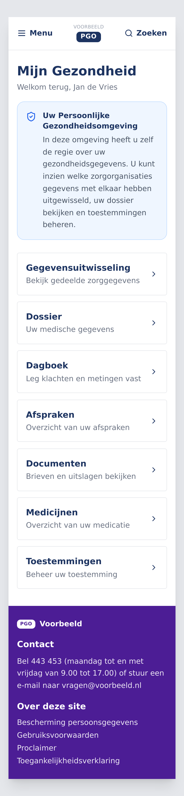

De transparantiefunctie is in dit ontwerp geplaatst binnen een bestaande persoonlijke gezondheidsomgeving. Hiermee wordt onderzocht hoe inzicht in gegevensuitwisselingen in de context van een bestaande dienstverlening kan worden aangeboden, in plaats van uitsluitend als afzonderlijke applicatie.

Dit sluit aan bij de behoefte van gebruikers om transparantie te vinden op het moment en de plek waar deze relevant is, zonder daarvoor eerst een afzonderlijke transparantievoorziening te hoeven kennen of opzoeken.

---

### Gegevensuitwisselingen per organisatie

  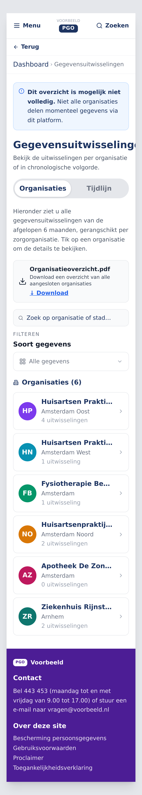

Het organisatieoverzicht vormt een van de belangrijkste ingangen tot de informatie. Gebruikers kunnen zien met welke organisaties gegevens zijn uitgewisseld en vervolgens doorklikken om de gegevensuitwisselingen van een specifieke organisatie te bekijken.

Bovenaan wordt expliciet aangegeven dat het overzicht mogelijk niet volledig is. Hiermee wordt voorkomen dat de interface onbedoeld de indruk wekt dat alle organisaties en gegevensuitwisselingen in het overzicht zijn opgenomen.

Gebruikers kunnen daarnaast schakelen tussen het organisatieoverzicht en een chronologische tijdlijn. Hiermee worden verschillende manieren van zoeken en oriënteren ondersteund.

#### Detailweergave organisatieoverzicht

  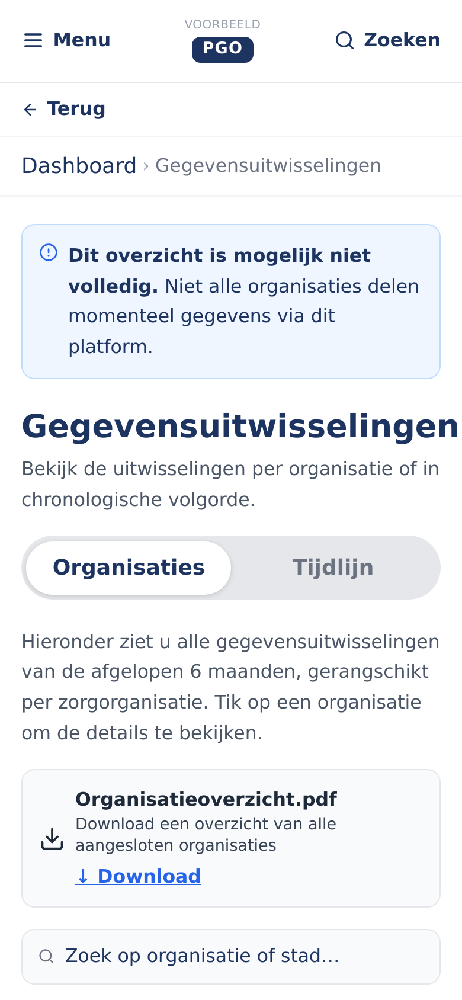
  &nbsp;&nbsp;
  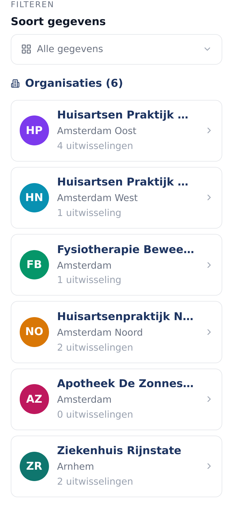

De detailweergaven laten zien hoe informatie over organisaties en gegevensuitwisselingen wordt opgebouwd. Organisaties fungeren hierbij als herkenningspunt van waaruit de gebruiker verder kan verdiepen.

---

### Zoeken en filteren

Gebruikers kunnen het overzicht filteren op het soort gegevens, zoals labuitslagen, recepten, medicatie of ontslagbrieven.

  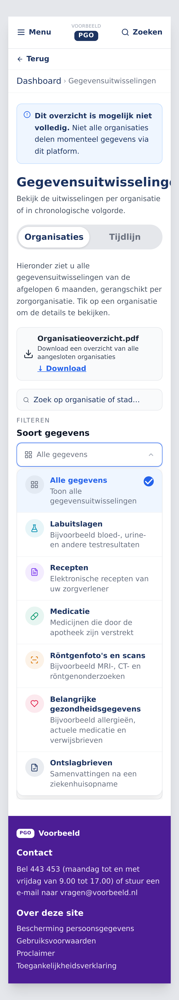
  &nbsp;&nbsp;
  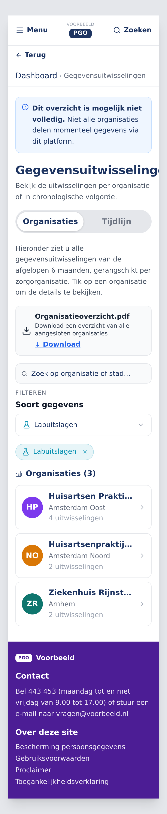

Na het toepassen van een filter worden alleen de organisaties getoond waarvoor relevante gegevensuitwisselingen beschikbaar zijn.

Naast filteren kan de gebruiker rechtstreeks zoeken naar een organisatie.

  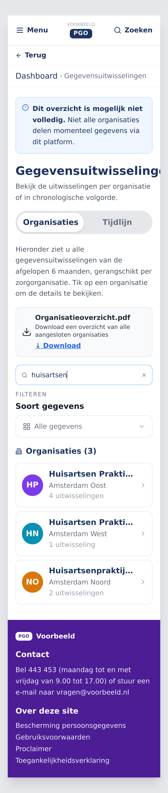
  &nbsp;&nbsp;
  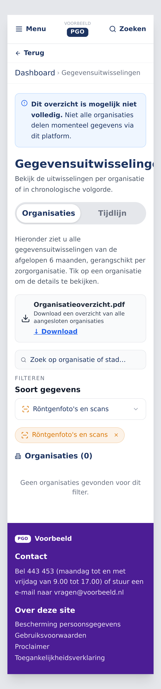

Wanneer een zoekopdracht of filter geen resultaten oplevert, wordt dit expliciet weergegeven. Hiermee ondersteunt het ontwerp verschillende zoekstrategieën en hoeft de gebruiker niet één vaste route door de informatie te volgen.

---

### Tijdlijn

  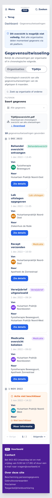

Naast het organisatieoverzicht kan de gebruiker kiezen voor een chronologische weergave. De tijdlijn maakt zichtbaar **wanneer gegevens zijn uitgewisseld, tussen welke organisaties dit gebeurde en om welk type gebeurtenis het gaat**.

Hiermee kan de gebruiker gebeurtenissen vanuit een ander perspectief bekijken dan in het organisatieoverzicht. Dit is bijvoorbeeld relevant wanneer iemand vooral wil begrijpen wat er rondom een bepaalde periode is gebeurd.

#### Detailweergaven tijdlijn

  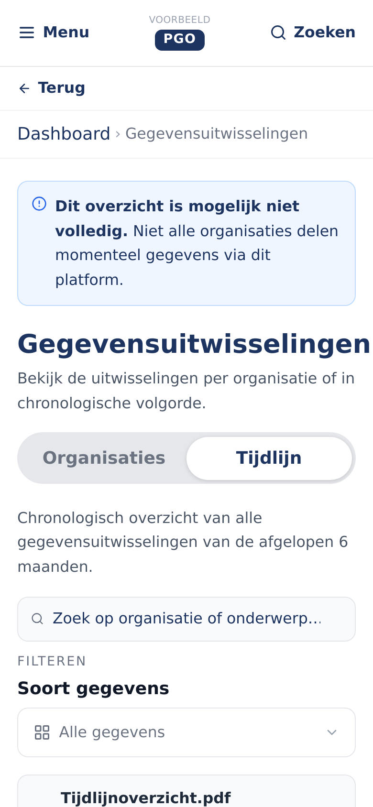
  &nbsp;
  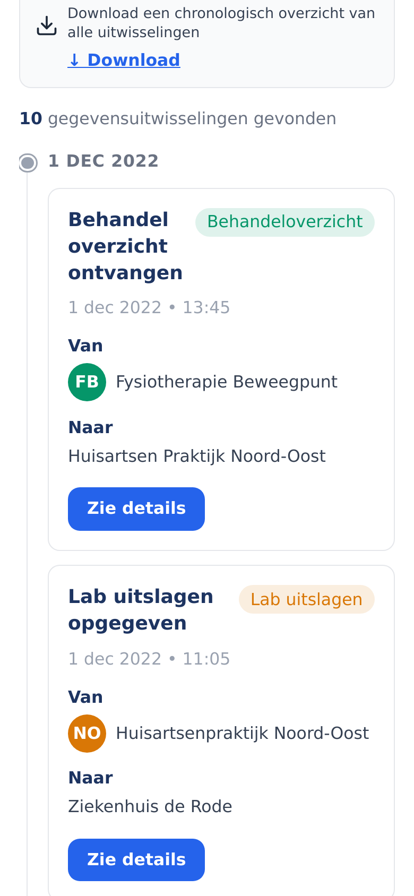
  &nbsp;
  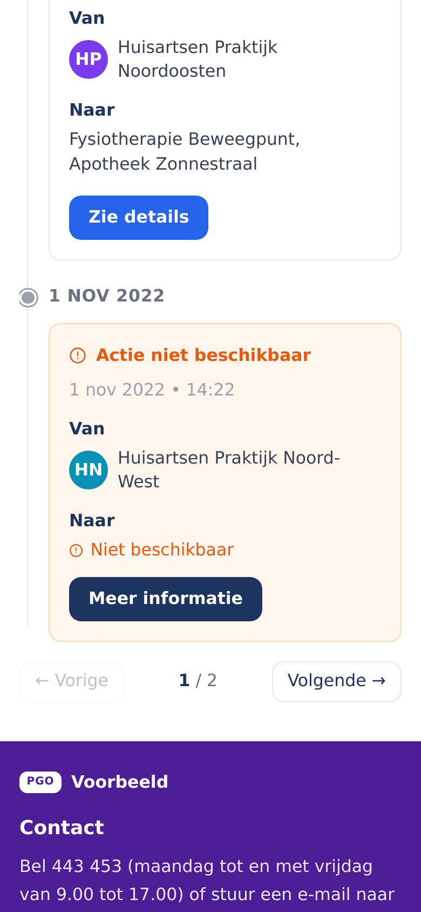

De detailweergaven laten zien hoe afzonderlijke gebeurtenissen binnen de tijdlijn worden gepresenteerd en hoe de gebruiker vanuit een gebeurtenis verder kan verdiepen.

Ook binnen de tijdlijn kunnen gebruikers zoeken en filteren.

  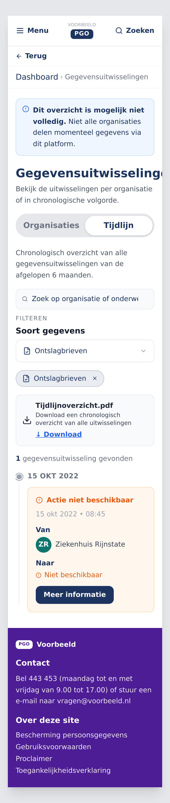

Zo kunnen gebruikers vanuit verschillende mentale modellen bij dezelfde informatie komen: via een organisatie, via een chronologisch overzicht of via zoeken en filteren.

---

### Organisatiedetail

  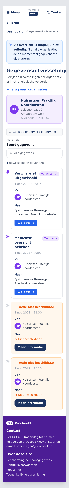

Vanuit het organisatieoverzicht kan worden ingezoomd op één specifieke organisatie. De gebruiker ziet vervolgens de gegevensuitwisselingen waarbij deze organisatie betrokken is.

De organisatie fungeert hierbij als herkenningspunt. Vanuit deze herkenbare context kan de gebruiker verder onderzoeken welke gegevens zijn uitgewisseld, wanneer dit gebeurde en met welke andere organisaties.

#### Detailweergaven organisatie

  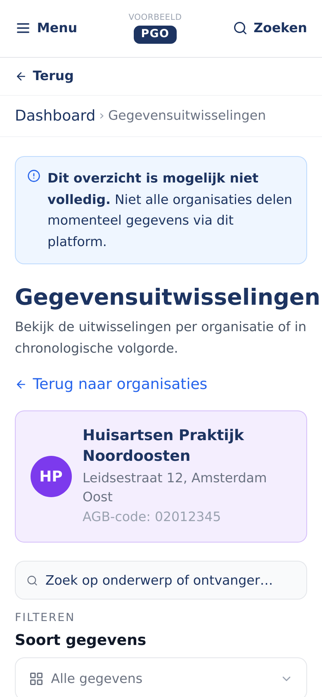
  &nbsp;
  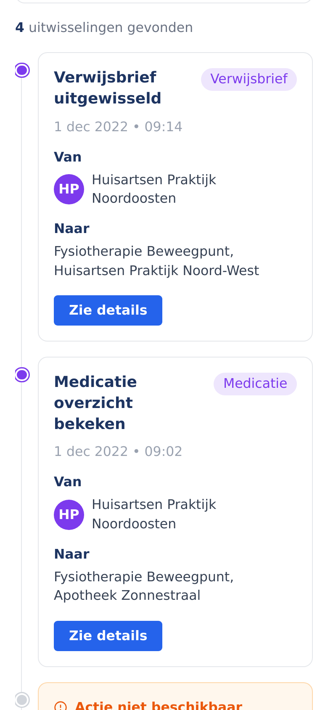
  &nbsp;
  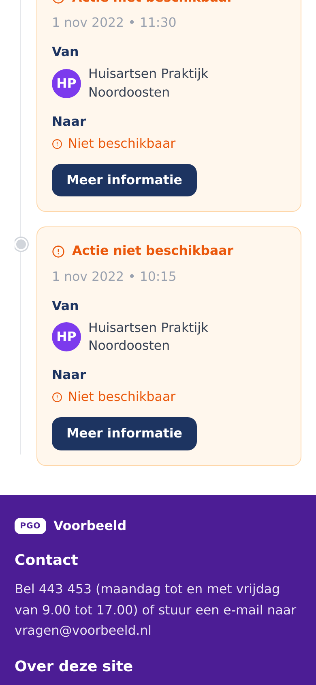

De gebruiker krijgt hiermee eerst een overzicht van de organisatie en kan vervolgens per gebeurtenis verder verdiepen.

---

### Detail van een gegevensuitwisseling

  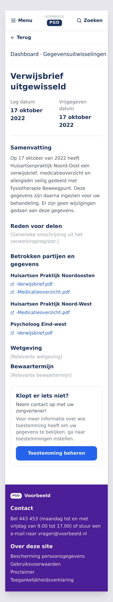

Op detailniveau wordt meer context gegeven over een specifieke gegevensuitwisseling. De gebruiker ziet onder andere wanneer de uitwisseling heeft plaatsgevonden, welke organisaties betrokken waren, welke gegevens zijn gedeeld en wat de reden voor de uitwisseling was.

#### Detailweergaven gegevensuitwisseling

  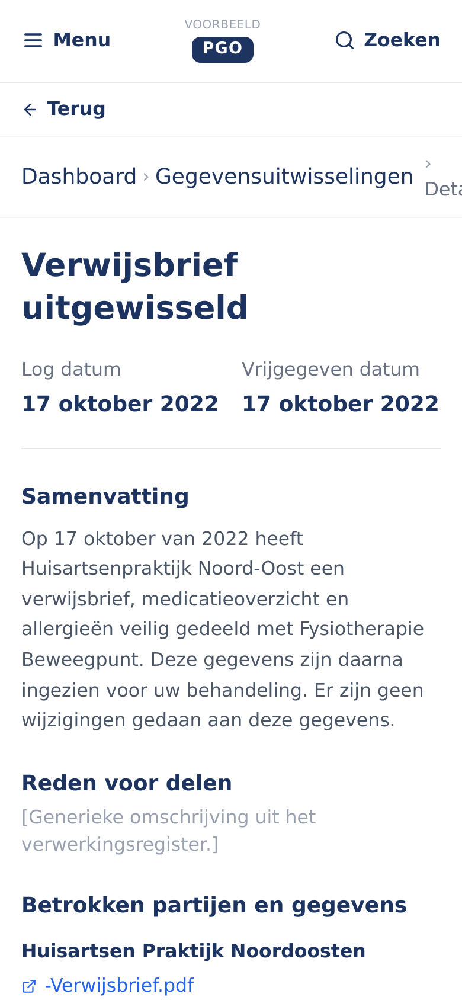
  &nbsp;&nbsp;
  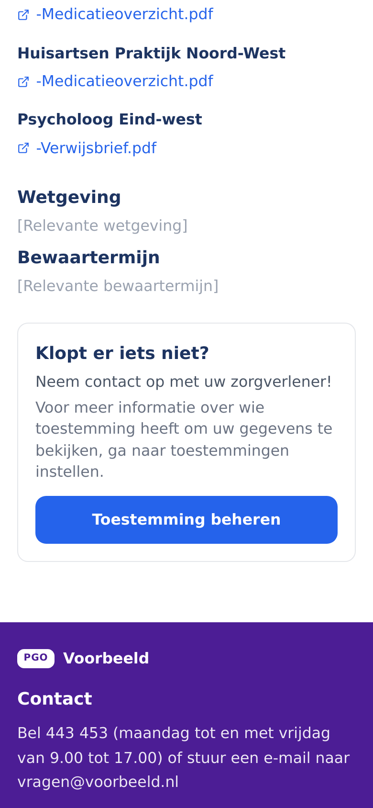

Hiermee wordt de gebruiker stapsgewijs van herkenning naar meer gedetailleerde uitleg geleid. Wanneer een gebruiker denkt dat iets niet klopt, wordt daarnaast handelingsperspectief aangeboden door te verwijzen naar de verantwoordelijke organisatie of een relevante vervolgstap.

---

### Omgaan met incomplete informatie

Een belangrijk aandachtspunt uit de laatste gebruikerstest is de manier waarop incomplete informatie wordt gecommuniceerd. Wanneer informatie ontbreekt zonder duidelijke verklaring, kunnen gebruikers onzeker worden over de betrouwbaarheid en volledigheid van het gehele overzicht.

Het final design maakt daarom explicieter zichtbaar dat het overzicht mogelijk niet volledig is. Hiermee wordt voorkomen dat een gedeeltelijk overzicht automatisch als volledig wordt geïnterpreteerd.

In een verdere uitwerking moet duidelijk onderscheid worden gemaakt tussen verschillende oorzaken van ontbrekende informatie:

- een organisatie is niet aangesloten;
- er heeft geen gegevensuitwisseling plaatsgevonden;
- gegevens zijn tijdelijk niet beschikbaar.

Wanneer incomplete gegevens onvoldoende betrouwbaar of begrijpelijk kunnen worden aangeboden, kan worden overwogen deze gegevens nog niet te tonen. Het is daarbij wel belangrijk om transparant te blijven over de dekking van het systeem, bijvoorbeeld door zichtbaar te maken welke organisaties wel en niet zijn aangesloten en waar nodig naar de betreffende organisatie te verwijzen.

> **Openstaand verbeterpunt**
>
> In het huidige prototype wordt bij sommige gegevensuitwisselingen nog de melding **'Actie niet beschikbaar'** getoond. Uit de laatste gebruikerstest blijkt dat deze melding onvoldoende uitlegt waarom informatie ontbreekt. Dit kan leiden tot onzekerheid, speculatie en mogelijk wantrouwen.
>
> In een volgende uitwerking moet deze generieke melding daarom worden vervangen door een concrete verklaring, bijvoorbeeld **'Deze organisatie is nog niet aangesloten'**, **'Er heeft geen gegevensuitwisseling plaatsgevonden'** of **'Deze gegevens zijn tijdelijk niet beschikbaar'**.
>
> Waar mogelijk wordt hier direct een relevante vervolgstap aan gekoppeld, zoals contact opnemen met of doorgaan naar de betreffende organisatie.

---

### Belangrijkste ontwerpprincipes

Het final design brengt de belangrijkste inzichten uit het gebruikersonderzoek samen:

1. **Bied transparantie in context**  
   Bied inzicht in gegevensuitwisselingen waar mogelijk binnen bestaande systemen en gebruikersreizen, zodat de gebruiker niet eerst een afzonderlijke transparantievoorziening hoeft te vinden.

2. **Begin met herkenning en bouw daarna verdieping op**  
   Organisaties, gebeurtenissen en datums bieden herkenningspunten. Vanuit deze context kan de gebruiker verder verdiepen in wat er is gebeurd en waarom.

3. **Ondersteun verschillende mentale modellen**  
   Bied meerdere routes naar dezelfde informatie, bijvoorbeeld via organisaties, een chronologische tijdlijn, zoeken en filteren.

4. **Wees transparant over de grenzen van het overzicht**  
   Maak duidelijk wanneer informatie mogelijk niet volledig is en leg uit waarom bepaalde informatie ontbreekt. Voorkom dat een gedeeltelijk overzicht de suggestie van volledigheid wekt.

5. **Koppel transparantie aan handelingsperspectief**  
   Wanneer iets onduidelijk is of mogelijk niet klopt, moet de gebruiker kunnen begrijpen wat die vervolgens kan doen en bij welke organisatie die terechtkan.

6. **Toon informatie op het juiste detailniveau**  
   Begin met een begrijpelijk overzicht en bied vervolgens verdieping voor gebruikers die meer willen weten. Zo blijft de informatie toegankelijk zonder relevante details weg te laten.

---

### Conclusie final design

Het final design verschuift de focus van het uitsluitend **tonen van gegevensuitwisselingen** naar het ondersteunen van de gebruiker bij het **herkennen, begrijpen en controleren** van wat er met gegevens gebeurt.

Daarbij is transparantie niet alleen een kwestie van zoveel mogelijk informatie beschikbaar stellen. De informatie moet ook begrijpelijk, betrouwbaar en in de juiste context worden aangeboden. Wanneer informatie ontbreekt, moet dit worden verklaard en waar nodig worden gekoppeld aan een vervolgstap.

Het ontwerp vormt daarmee een basis voor een transparantievoorziening waarin **herkenning, context, verklaring en handelingsperspectief** samen bijdragen aan meer begrip en vertrouwen.

